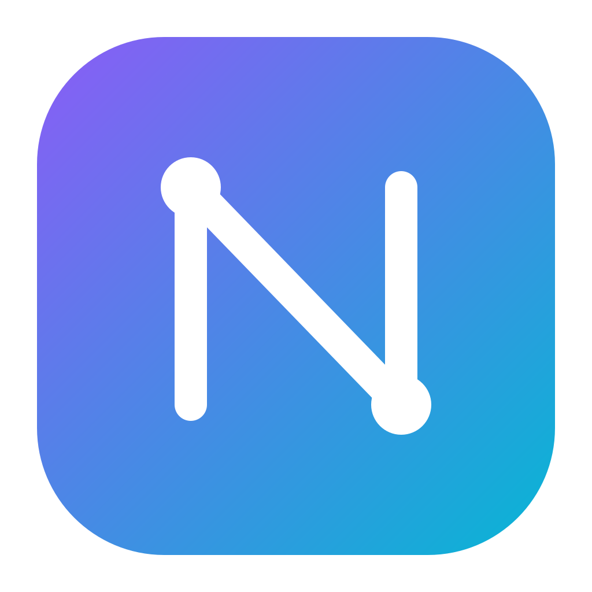
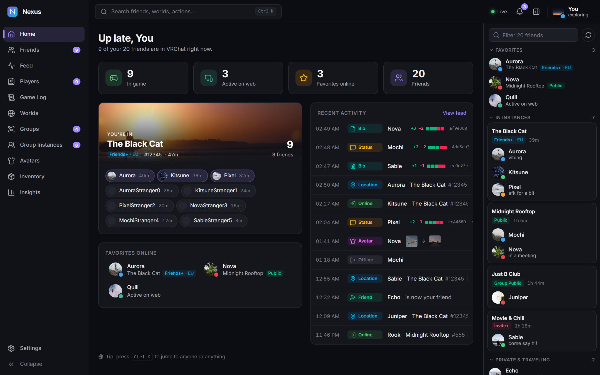
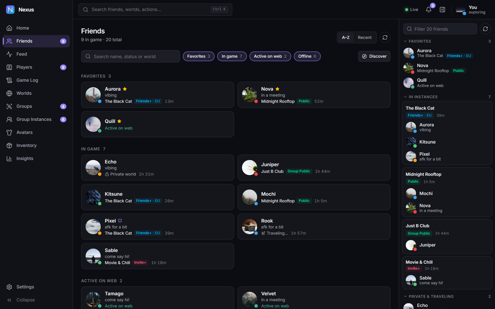
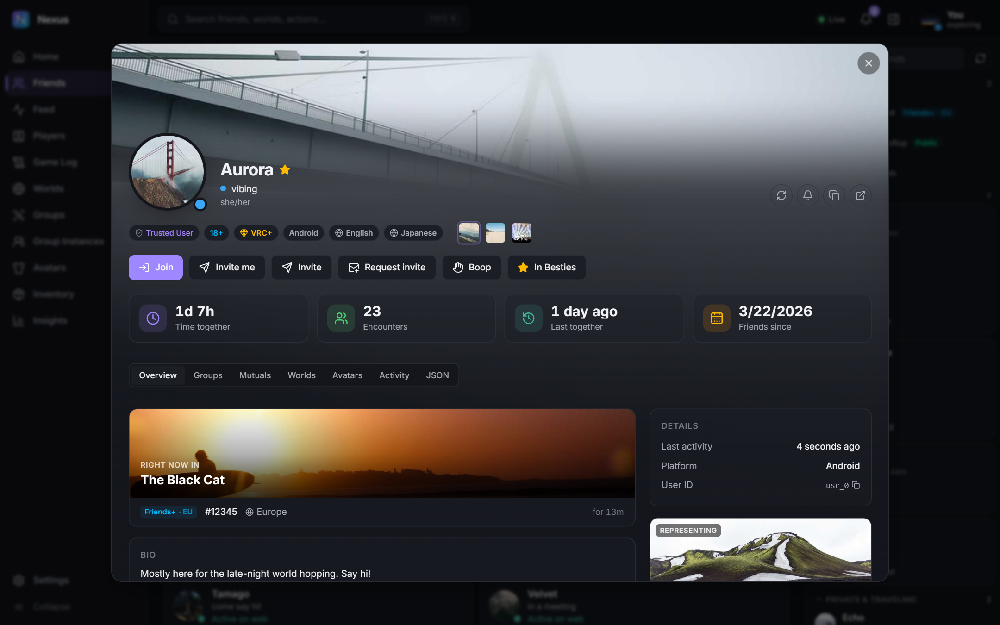
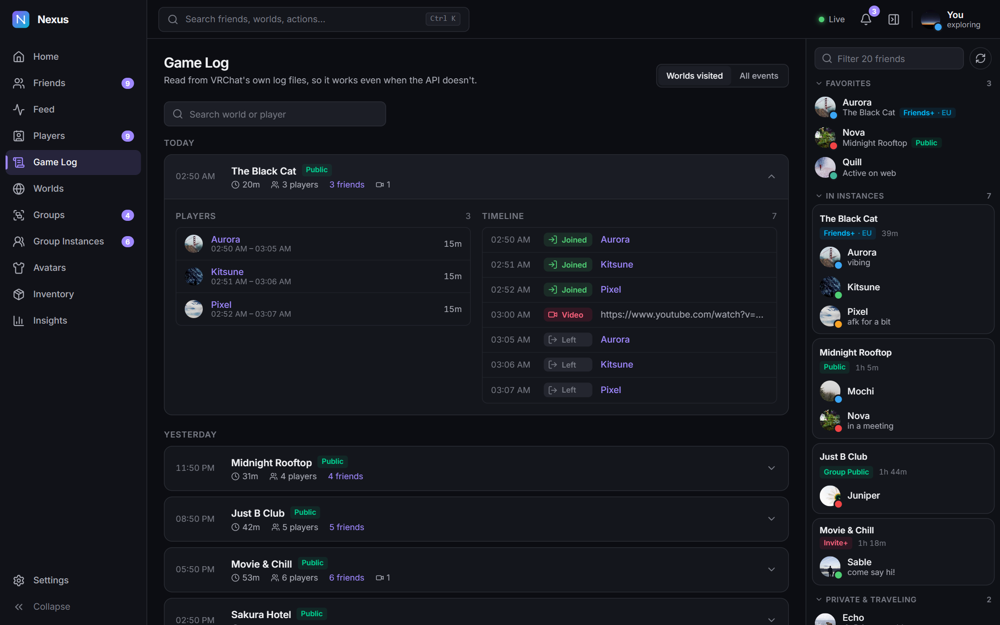
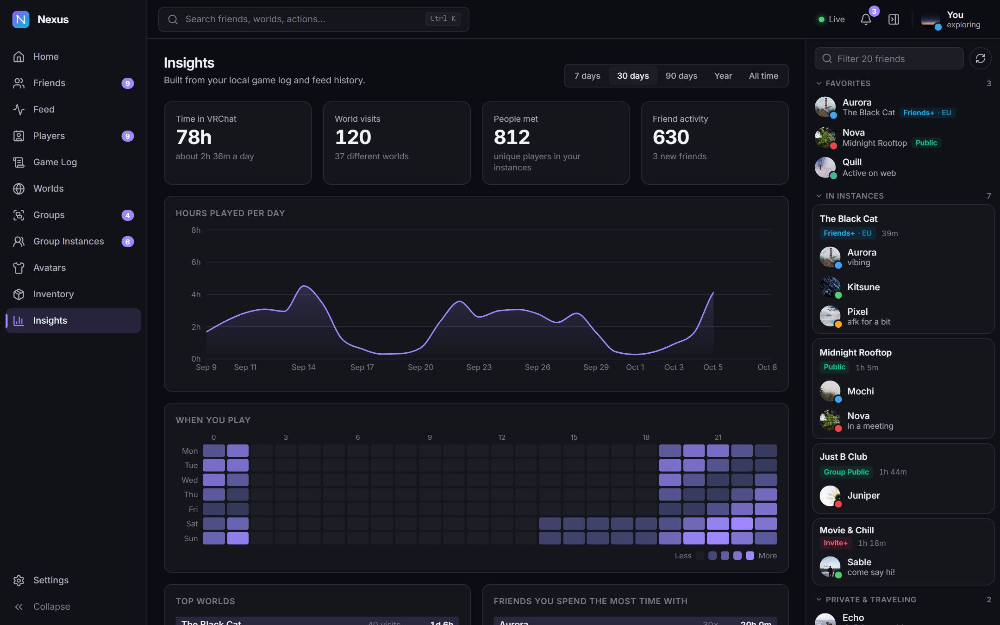
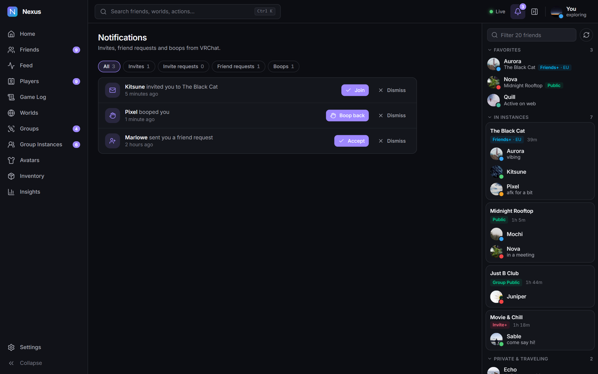
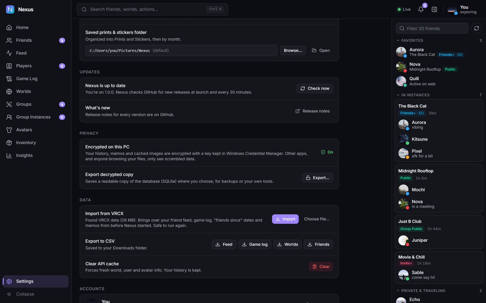

<div align="center">



# Nexus

**A fast, modern VRChat companion for Windows.**
Live friends, a searchable history of everything they did, a game log of every world you visit, and insights into how you play, all kept private and encrypted on your PC.

[](https://github.com/LunoviaVR/Nexus/releases/latest)
[](https://github.com/LunoviaVR/Nexus/releases)


[Download](https://github.com/LunoviaVR/Nexus/releases/latest) · [What's new](https://github.com/LunoviaVR/Nexus/releases) · [Screenshots](#-screenshots) · [Privacy](#-privacy--your-data) · [Build from source](#-building-from-source)

<br />



</div>

---

## ✨ Features

| | |
|---|---|
| **👥 Live friends** | Status and location update the instant they change over VRChat's live connection. Friends are grouped by instance, with one-click Join, Invite and Request invite. **Discover** new people and send friend requests. |
| **🪪 Profiles** | Banner hero with a colour fade, time-together stats, where they are right now, bio, VRChat notes and private memos, mutuals, groups, worlds, seen avatars and full activity history. Click any encounter to open it in the Game Log. |
| **📜 Feed** | Every online/offline, location, status, avatar, bio and friend/unfriend change, searchable and filterable. |
| **🎮 Game Log & Players** | Read from VRChat's own logs: every world you visited, a tidy list of who was there and for how long, a timeline of joins, leaves and videos, plus a live list of everyone in your current instance. |
| **🔔 Notifications** | Invites, invite requests, friend requests and boops, filterable by type, with Accept, Join, Boop back and more. Windows notifications with a switch for each kind, plus per-friend online alerts. |
| **🌍 Worlds, groups & avatars** | Browse and search worlds and see their instances. Manage and **discover** groups, browse group instances with rich filters, and switch or discover avatars. |
| **📊 Insights** | Hours played per day, a when-you-play heatmap, top worlds and top friends, from 7 days to all time. |
| **🖼️ Inventory** | Your prints, emojis, icons and banners, with uploads (VRC+). |
| **🔁 VRCX import** | One click brings your VRCX history into Nexus without duplicates. |
| **🔒 Encrypted at rest** | Your history and cached images are encrypted with a key held in Windows Credential Manager. |
| **⚡ Quality of life** | Ctrl + K command palette, dark/light themes with accent colours, tray icon with status switcher, start with Windows, multiple accounts, CSV export, signed automatic updates. |

See the [release notes](https://github.com/LunoviaVR/Nexus/releases) for the full list.

## 📸 Screenshots

| | |
|---|---|
|  |  |
| **Friends:** live status and location, grouped and searchable | **Profiles:** banner fade, time together, where they are right now |
|  |  |
| **Game Log:** who was there, for how long, and what happened | **Insights:** hours played, when you play, top worlds and friends |
|  |  |
| **Notifications:** invites, friend requests and boops, filterable | **Settings:** signed updates, encryption, VRCX import |

<sub>Screenshots use Nexus's built-in demo data; the names and pictures are made up.</sub>

## 📥 Install

1. Download **`Nexus_x.y.z_x64-setup.exe`** from the [latest release](https://github.com/LunoviaVR/Nexus/releases/latest).
2. Run it. It installs for your user only, with no admin rights needed.
3. Sign in with your VRChat account (two-factor authentication is supported).

> **"Windows protected your PC"?** The installer isn't code-signed with a paid certificate yet, so SmartScreen may warn the first time. Click **More info → Run anyway**. Updates are still cryptographically signed and verified by Nexus itself.

**Requirements:** Windows 10 or 11 (64-bit) with the WebView2 runtime, which ships with Windows 11 and is installed automatically on Windows 10 if missing.

### Updating

Nexus checks GitHub for a new release at launch and every 30 minutes, and offers it in a notification. Click **Install & restart**. You can also check by hand in **Settings → Updates**. Every update is signed, and Nexus refuses anything that doesn't match its built-in public key.

## 🔁 Moving from VRCX

Open **Settings → Data → Import from VRCX** and click **Import**. Nexus finds `%APPDATA%\VRCX\VRCX.sqlite3` on its own (or choose the file yourself) and brings over:

- your friend feed (location, online/offline, status, avatar and bio changes, friends and unfriends),
- your game log (worlds, the people you were with, videos),
- "friends since" dates, and memos.

Only history from **before** Nexus started recording is imported, so nothing is doubled, and importing again is harmless. VRCX can stay open; its files are only read, from a temporary copy.

## 🔒 Privacy & your data

Nexus has no servers. It talks only to **VRChat**, to **GitHub** (to check for updates) and to **[avtrDB](https://avtrdb.com)** when you use Avatar discover. There is no analytics or telemetry.

| What | Where | Protected by |
|---|---|---|
| Your history: feed, game log, encounters, friend log, memos, settings | `%APPDATA%\app.nexus.vrchat\nexus.db` | **SQLCipher** (AES-256) |
| Cached VRChat images | `%LOCALAPPDATA%\app.nexus.vrchat\images-enc\` | **AES-256-GCM**, keyed file names |
| Encryption key | Windows Credential Manager (`nexus-vrchat` / `database-key`) | Your Windows account |
| VRChat session, and your password only if you tick *Remember password* | Windows Credential Manager (`nexus-vrchat` / your user ID) | Your Windows account |
| UI preferences (theme, sidebar, layout) | WebView storage in `%LOCALAPPDATA%\app.nexus.vrchat` | Nothing personal |

The encryption key is generated randomly on your PC the first time Nexus starts. Without it the database and image cache are unreadable, so other apps and anyone browsing your files only see scrambled data.

**Reading your own data:** *Settings → Privacy → Export decrypted copy* saves a normal SQLite file wherever you choose, after a confirmation. That copy is **not** encrypted, so delete it when you're done.

**Removing everything:** uninstall Nexus, delete the two `app.nexus.vrchat` folders above, and remove the `nexus-vrchat` entries in *Control Panel → Credential Manager → Windows Credentials*.

> If the key in Credential Manager is ever deleted, the old database can't be decrypted. Nexus moves it aside (`nexus.db.unreadable-…`) and starts fresh rather than failing.

## 🛠️ Building from source

### Requirements

- **Windows 10/11** with the **Visual Studio C++ Build Tools** (the "Desktop development with C++" workload)
- **[Node.js](https://nodejs.org) 20+**
- **[Rust](https://rustup.rs) 1.82+** (stable, MSVC toolchain)
- **[Strawberry Perl](https://strawberryperl.com)**, which is needed to compile OpenSSL for SQLCipher:
  ```powershell
  winget install StrawberryPerl.StrawberryPerl
  ```
  Open a **new** terminal afterwards so it's on your `PATH`. If the build still picks up Git's Perl, set `PERL=C:\Strawberry\perl\bin\perl.exe`.

### Run

```bash
npm install
npm run tauri dev
```

`npm run tauri dev` opens the real app with hot reload: UI changes show instantly, and Rust changes rebuild and relaunch.

`npm run dev` on its own serves the UI in a normal browser with a **mock backend** (`src/lib/mock.ts`), which is handy for UI work without signing in.

### Test

```bash
npm run typecheck
npm test                      # location and text parsing (vitest)
cd src-tauri && cargo test    # log parser, database, encryption, VRCX import, updates
```

To exercise the game-log tailer without VRChat, point it at fixture logs:

```bash
NEXUS_LOG_DIR=src-tauri/tests/fixtures npm run tauri dev
```

### Build an installer

```bash
npm run tauri build
```

Installers land in `src-tauri/target/release/bundle/`. Because the updater is enabled, a release build must be signed: set `TAURI_SIGNING_PRIVATE_KEY` to your updater private key (see below), or remove `createUpdaterArtifacts` from `src-tauri/tauri.conf.json` for an unsigned local build.

## 🚀 Releasing

Releases are built and published by GitHub Actions ([`.github/workflows/release.yml`](.github/workflows/release.yml)).

**One-time setup:**

1. Generate an updater signing key (keep the private key safe and out of the repo):
   ```bash
   npx tauri signer generate -w ~/.tauri/nexus-updater.key
   ```
2. Put the public key (`nexus-updater.key.pub`) in `src-tauri/tauri.conf.json` → `plugins.updater.pubkey`.
3. In the GitHub repo, go to **Settings → Secrets and variables → Actions** and add:
   - `TAURI_SIGNING_PRIVATE_KEY`: the **contents** of `nexus-updater.key`
   - `TAURI_SIGNING_PRIVATE_KEY_PASSWORD`: its password (an empty value if none)

**Each release:**

1. Bump the version in `package.json`, `src-tauri/tauri.conf.json` and `src-tauri/Cargo.toml`.
2. Write the notes in `docs/releases/vX.Y.Z.md`; they become the release description.
3. Commit, then tag and push:
   ```bash
   git tag v1.2.3
   git push origin main --tags
   ```
4. The workflow tests, builds, signs and creates a **draft** release with the installers and `latest.json`. Review it and click **Publish**. Installed copies pick it up within 30 minutes.

> ⚠️ Losing the private key means existing installs can no longer verify updates. Back it up somewhere safe.

## 🧭 How it works

```
React UI ──invoke──► Rust core (Tauri 2)
   ▲                   ├─ api.rs        VRChat REST: session cookies, ~3 req/s pacing, 429 backoff
   └──── events ────── ├─ pipeline.rs   VRChat websocket → friend, user, group and notification events
                       ├─ sync.rs       friend model, feed diffs, Windows notifications, TTL cache
                       ├─ gamelog.rs    tails output_log_*.txt; notices when VRChat quits or crashes
                       ├─ db.rs         SQLCipher database: feed, game log, presence, memos, cache
                       ├─ vault.rs      encryption keys (Credential Manager) and image-cache crypto
                       ├─ images.rs     nximg:// protocol with an encrypted on-disk image cache
                       ├─ vrcx.rs       one-click import from VRCX
                       └─ session.rs    VRChat session cookies in Windows Credential Manager
```

- **Frontend:** React 19, TypeScript, Tailwind CSS 4, TanStack Query, Zustand, Radix UI, Recharts.
- **Backend:** Rust, Tauri 2, rusqlite with SQLCipher, reqwest, tokio-tungstenite.
- VRChat asks API clients to send a descriptive `User-Agent`. Nexus sends `Nexus/<version> (+https://github.com/LunoviaVR/Nexus)` (see `src-tauri/src/api.rs`).

## ❓ Troubleshooting

- **The Game Log and Players page are empty:** VRChat's logging must be on (it is by default). If your logs live elsewhere, set the folder in **Settings → VRChat log folder**.
- **"Your VRChat session expired":** sign in again. With *Remember password* ticked, Nexus can sign you back in on its own.
- **Build fails configuring OpenSSL** (`Can't locate Locale/Maketext/Simple.pm` or `makefile wasn't produced`): Git's Perl is being used. Install Strawberry Perl and set `PERL=C:\Strawberry\perl\bin\perl.exe`.

## ⚖️ Disclaimer

Nexus is a fan-made project and is **not affiliated with, endorsed by or sponsored by VRChat Inc.** It uses the same unofficial API as other community tools such as VRCX, paces its requests and identifies itself properly. Use it responsibly and within [VRChat's Terms of Service](https://hello.vrchat.com/legal).
